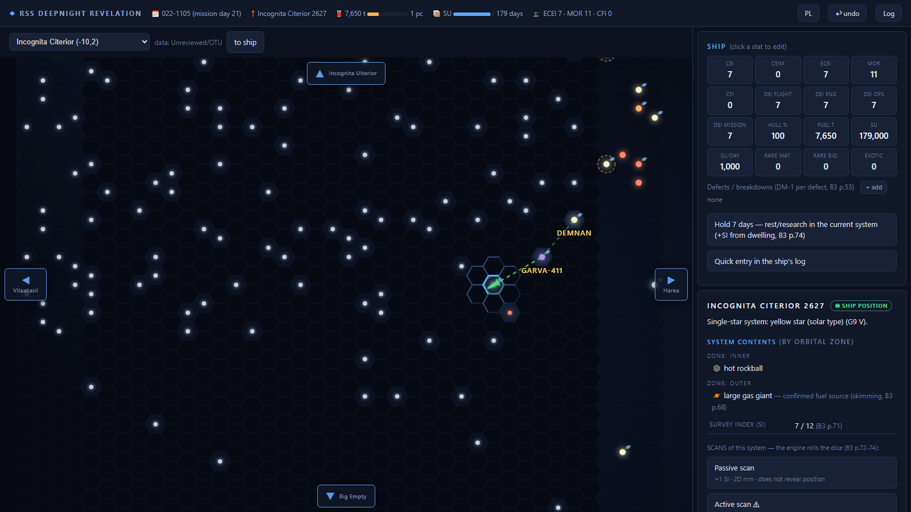
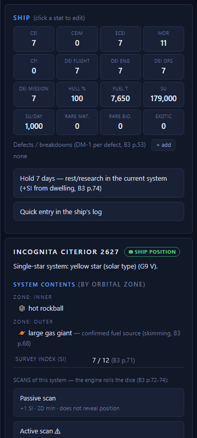
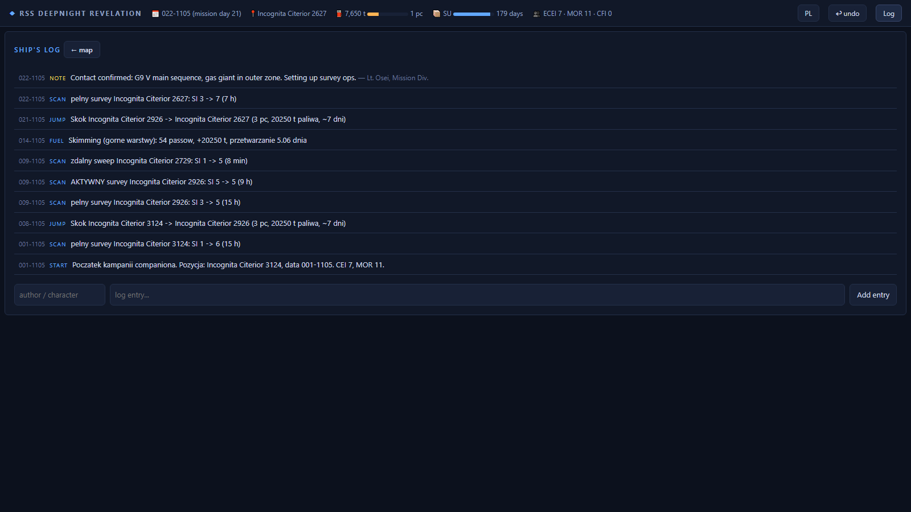

# Deepnight Companion

A players'-screen **navigation companion** for the *Traveller: Deepnight Revelation*
campaign (Mongoose Traveller, 2nd Edition). It runs locally on the table laptop and
tracks the things that are tedious to track by hand on a 20-year expedition:
position, fuel, supplies, the imperial calendar — and above all **what the crew
actually knows about each star system**, using the Survey Index rules from the
Referee's Handbook.

No book text is included — you need the Deepnight Revelation boxed set to play.
The tool only implements procedures, always with page references (e.g. *B3 p.71*).



## What it does

- **Hex map of the expedition route** — dotmaps of the Great Rift sectors
  (travellermap.com data), with zoom/pan, the ship's trail, jump range overlay
  and neighbour-sector previews at the edges.
- **Survey Index (B3 p.71)** — players only see what their sensors have earned:
  star presence → spectral class → gas giants → full body lists → surface details.
- **Scans with real dice** — passive / active / full surveys in-system, remote
  sensor sweeps at range (B3 p.72-74). The engine rolls server-side and shows the
  full breakdown (dice + DMs + target + Effect). The *largest-increase* rule is
  enforced, and active scans reveal your position, as the book demands.
- **Jumps & fuel** — J-4, 6,750 t/parsec, multi-jump course plotting toward
  distant targets, gas-giant skimming (750 t/pass deep, 375 t safe), empty-hex
  Short-Range Detection (B3 p.75-76).
- **Ship & crew state** — CEI/CEIM/MOR/CFI, division efficiency (DEI), supply
  units budget, defects/breakdowns, all hand-editable with a reason that goes to
  the log.
- **Deterministic system generation** — unexplored systems are generated with the
  B3 procedures from a seed derived from `sector:hex`, so the same hex always
  yields the same system; canon map data overrides the generator.
- **Ship's log** — every action is logged automatically; players can add entries.
  One-click **undo** for table mistakes.
- **Player view vs GM view** — the player UI never receives `gm_*` fields or data
  above the current Survey Index. GM mode is an HTTP header (see below).
- **English / Polish UI** — toggle in the top bar (English is the default).

| System panel | Ship's log |
|---|---|
|  |  |

## Quick start — Windows, no Python needed

1. Download `DeepnightCompanion-*.zip` from
   [Releases](../../releases), unzip anywhere.
2. Double-click `DeepnightCompanion.exe`. Your browser opens
   `http://localhost:8010/`.
3. Campaign state lives in a `state/` folder created next to the exe.
   **Delete that folder to reset the campaign.**

> Windows SmartScreen may warn about an unsigned exe — choose
> *More info → Run anyway*, or use the from-source route below.

## Run from source (Windows / Mac / Linux)

Requires Python 3.11+.

```bash
git clone https://github.com/mtgodala/deepnight-companion.git
cd deepnight-companion
python -m venv .venv
. .venv/bin/activate            # Windows: .venv\Scripts\activate
pip install -e .
python run_companion.py         # or start_companion.bat / start_companion.sh
```

## GM mode

The browser UI is the **player view**. To see full system records (including
`gm_*` notes and data above the players' Survey Index), send the token from
`gm_token.txt` (generated on first run, next to the exe / repo root):

```bash
curl -H "X-GM-Token: <token>" http://localhost:8010/api/system/Vland/0211
```

Any REST client or a browser header-modifying extension works. Don't show the
token to your players.

## Rules implementation notes

- The rules engine lives in `companion/rules/` — every constant and procedure
  cites its book page. A detailed spec (in Polish) is in
  `companion/docs/rules-spec.md`.
- Known misprints in the Referee's Handbook are house-ruled and marked `# HR:`
  in `companion/rules/tables.py`.
- Tests: `pip install -e .[dev]` then `pytest companion/tests/`.
- Sector data can be refreshed with `python scripts/fetch_map_data.py`
  (downloads from travellermap.com; attribution in
  `companion/data/sectors/manifest.json`).

## Feedback

This is a v0.1 built for one table and shared to gather feedback. Especially
interested in: rules-accuracy issues (with page refs), UX at the table, and
whether the generated systems feel right for the Rift.

## Legal

This is an unofficial, free fan-made tool released under the
[Far Future Enterprises Fair Use Policy](https://www.farfuture.net/FFEFairUsePolicy2008.pdf).
The Traveller game in all forms is owned by Far Future Enterprises; Traveller
is a registered trademark of Far Future Enterprises. *Mongoose Traveller* and
*Deepnight Revelation* are published by Mongoose Publishing. This tool is not
endorsed by or affiliated with either company, contains no book text, and is
unusable without the published campaign.

Sector map data © travellermap.com contributors (personal, non-commercial
use). Code is MIT-licensed — see [LICENSE](LICENSE).
